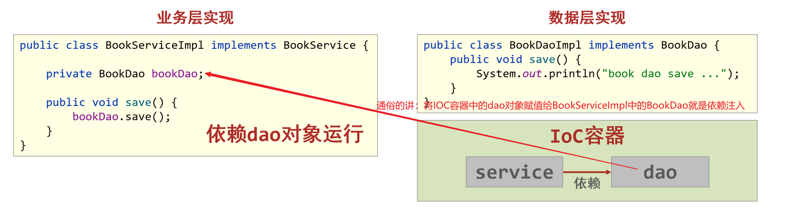

# Spring

## 学习目标

- [ ] 能够说出Spring的体系结构
- [ ] 能够编写IOC入门案例
- [ ] 能够编写DI入门案例
- [ ] 能够配置setter方式注入属性值
- [ ] 能够配置构造方式注入属性值
- [ ] 能够理解什么是自动装配

## 一、Spring简介

### 1 Spring课程介绍

#### 1.1 为什么要学

- Spring技术是JavaEE开发必备技能，企业开发技术选型命中率>==90%==

- 专业角度
  - ==**简化开发**==，降低企业级开发的复杂性
  - **==框架整合==**，高效整合其他技术，提高企业级应用开发与运行效率

#### 1.2 学什么

- 简化开发
  - ==IOC(反转控制)==
  - ==AOP(面向切面编程)==
    - ==事务处理==
- 框架整合
  - MyBatis
  - MyBatis-plus
  - Struts
  - Struts2
  - Hibernate
  - ……

#### 1.3 怎么学

- 学习Spring框架设计思想
- 学习基础操作，思考操作与思想间的联系
- 学习案例，熟练应用操作的同时，体会思想

### 3 Spring体系结构

#### 问题导入

通过系统架构图，Spring能不能进行数据层开发？Spring能不能进行web层开发？

#### 3.1 Spring Framework系统架构图

- Spring Framework是Spring生态圈中最基础的项目，是其他项目的根基

#### 3.2 Spring Framework课程学习路线

### 4 Spring核心概念

#### 问题导入

问题1：目前我们的代码存在什么问题以及怎么解决这些问题？

问题2：请描述什么是IOC，什么是DI？

#### 4.1 目前我们代码存在的问题

- 代码书写现状
  - 耦合度偏高
- 解决方案
  - 使用对象时，在程序中不要主动使用new产生对象，转换为由外部提供对象

#### 4.2 核心概念

- ==IOC（Inversion of Control）控制反转==

  **使用对象时，由主动new产生对象转换为由==外部==提供对象，此过程中对象创建控制权由程序转移到外部，此思想称为控制反转。通俗的讲就是“==将new对象的权利交给Spring，我们从Spring中获取对象使用即可==”**

- Spring技术对IoC思想进行了实现

  - Spring提供了一个容器，称为==IOC容器==，用来充当IoC思想中的“外部”
  - IOC容器负责对象的创建、初始化等一系列工作，被创建或被管理的对象在IoC容器中统称为==Bean==

- ==DI（Dependency Injection）依赖注入==

  - **在容器中建立bean与bean之间的依赖关系的整个过程，称为依赖注入。**

- **目标：充分解耦**
  - **使用IoC容器管理bean（IOC)**
  - **在IoC容器内将有依赖关系的bean进行关系绑定（DI）**
- 最终效果
  - **使用对象时不仅可以直接从IoC容器中获取，并且获取到的bean已经绑定了所有的依赖关系**