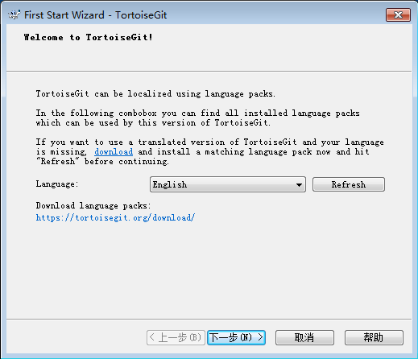
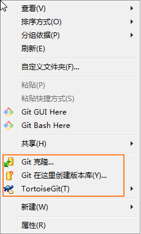

# Typora+Git+GitHub 轻量级笔记软件

**实现功能：**

将MarkDown笔记导出为html格式，同步至git服务器。优点一是本地与服务器各保存一份笔记，双保险；二是可以通过web访问，逐渐打造个人技术博客。

## 1: Typora

Typora，是一个简洁、免费的 Markdown 编辑器，支持 Windows、macOS 和 Linux 系统。

打开 Typora 的设置面板，点击 文件 >> 偏好设置。


将左侧切换到「图像」选项卡，右侧的第一个选项是一个下拉框，下拉之后选择「**复制到指定路径**」，接着勾选下方的「**优先使用相对路径**」，再接着**设置保存图片的路径**，这里我选择将图片保存在一个名为 assets 的文件夹中。

在路径后面添加 `\${filename}`，会对图片**自动进行归档**，将一篇文章中用到的图片都放到一个文件夹中。


如下图所示，保存图片的路径中添加了 `\${filename}`，它会在文件夹中自动生成一个**以文章标题为名**的子文件夹，这个子文件夹就存放了这篇文章中用到的所有图片。


## 2: GitHub账号注册

不过多说明。

官网地址：[https://github.com/](https://github.com/)

## 3：Git

### 3.1 客户端无 Git 

#### 3.1.1 **安装 Git 客户端**

我们想要将本地写的文章或者笔记上传到 GitHub，手动逐个上传文件还是比较麻烦，也不够优雅，这里我们使用一个程序员群体经常会用到的工具——**Git**，来帮我们快速地上传文件。

Git 支持 Windows、macOS 和 Linux 系统，下载之后，像平常安装软件那样安装 Git 即可。

Git 官网下载：[https://git-scm.com/downloads](https://git-scm.com/downloads)

**下面以在 windows 系统中安装 Git 客户端为例：**

下载运行最新版 Git for Windows 安装程序，注意选择对应32位或64位操作系统的版本。

使用默认的安装路径和选项即可。


在这一步，也可以选择您习惯使用的文本编辑器（如 `Notepad++`、`VS Code` 等）来代替默认的Vim


#### **3.1.2 安装图形化界面**

Git 客户端只能通过命令行使用，如果感觉不方便，可以安装图形化界面工具，如 TortoiseGit。

也可以通过其他开发工具，如 Eclipse、VS Code 等内置的图形化工具来使用 Git。

下面以安装 TortoiseGit for Windows 为例。

**注意：TortoiseGit 只是 Git 客户端的图形界面，它不能独立使用，仍然需要先安装 Git 客户端才能运行。**

下载运行最新的安装程序，注意选择 32 位或 64 位操作系统对应的版本。


注意这一步，**一定要选择 OpenSSH**，否则后续的步骤无法使用


其余步骤均可使用默认选项


安装完成后会弹出首次运行配置向导，先把这个窗口放在这里，不要关。



下面先安装中文语言包


装完后，回到刚才的配置向导窗口，点击刷新按钮，列表中就可以选择简体中文了。


确认 Git.exe 的安装路径


在这里输入你的**姓名**和**邮箱地址**


其余选项保持默认即可。


安装配置完毕，注销重新登录后，在文件夹空白处点击右键，即可看到 TortoiseGit 的菜单。



#### **3.1.3 添加 SSH Key**

服务器使用ssh协议，在您克隆项目之前，请先添加您个人的SSH密钥到服务器，下面以 Windows 为例。

首先在桌面或文件夹空白处点右键，选择 Git Bash Here


在出现的命令行窗口中输入下面的命令，其中的邮箱地址改为你自己的邮箱

```
ssh``-keygen -t rsa -C ``"xxx@xxxxxxx"` `-b 4096
```

**注意：生成密钥的命令中指定的邮箱地址，必须和 Git 客户端中填写的邮箱地址，以及在 GitHub 服务器端用户信息中注册的邮箱地址完全一致。**

一路回车，公私钥生成路径默认，验证密码为空。

然后用文本编辑器打开保存目录下的 id_rsa.pub 文件，复制全部内容到剪贴板。

得到公钥之后，打开 GitHub 官网，点击右上角的个人头像，选择 Settings 打开设置页面。


左侧栏切换到 **SSH and GPG keys** 选项卡，点击右上角的 **New SSH key**。


在打开的 SSH 配置页面，**在 Key 里面粘贴从 PowerShell 中复制的公钥**，而上面的 Title 可以随意写，可以写你当前正在使用的电脑名称，例如 dell_g7_ssh。

到这里，我们就完成了本地和 GitHub 仓库传输文件的配置。

### 3.2 客户端存在 Git

#### 3.2.1 Git配置多用户和邮箱

**前言**
在安装完Git之后，一般都要配置用户名和邮箱，在之后的每次提交中都会将其记录下来，这样就能清楚的知道都有谁进行了git提交。
之前使用的过程中一直没有遇到问题，但是自从换了工作单位后，新的公司使用的是git进行版本管理，有了一个拿公司邮箱注册的Git账号，然后就和我本身的Git账号有了冲突-------提交时被记录的用户和邮箱有问题。
Git的用户信息配置
Git的配置一共有三个级别：system(系统级)、global(用户级)和local(版本库)。

system的配置整个系统只有一个，global的配置每个账户只有一个，local的配置取决于Git版本库数量，在版本库才能看到。从Git官网的资料来看，这三个级别是逐层覆盖的。首先去查找system配置，其次查找global配置，最后查找local配置。逐层查找的过程中若查到配置值，则会覆盖上一层的配置。假如三个级别都配置了用户信息，则最后生效的配置是local。

**Git配置用户名邮箱的命令**
system配置

```
git config --system user.name "username"
git config --system user.email user@email.com
```

global配置

```
git config --global user.name "username"
git config --global user.email user@email.com
```

local配置

```
git config --local user.name "username"
git config --local user.email user@email.com
```

当有多个账号信息时，为了区分不同账户提交的记录。可以配置global级为常用的用户和邮箱信息。对于不常用的，可以在对应的版本库里配置单独的用户和邮箱信息。

**配置本地用户签名**

进入本地仓库同步目录（存放笔记的目录）。

初始化一个仓库

```
git init git_learning
```

进入`git_learning`

```
cd git_learning
#设置用户名邮箱
git config --local user.name '你的用户名'
git config --local user.email '你的邮箱'
```

#### 3.2.2 配置SSH Key

**一台电脑存放多个git账户的多个rsa秘钥**

 **如何在一个电脑上存储多个git账户生成的多份`rsa`秘钥，实现多个账户同时使用配置的情况？今天，不幸又再次遇到这个问题。**

**问题描述**

之前的做法是重新生成一个`github`秘钥，覆盖掉之前的gitlab秘钥。每次切换过程就意味每次需要重新生成一份秘钥。只有两个账户的情况还能勉强接受下，某一天再想搞个小号刷副本时，这酸爽真的没法形容。

**解决办法**

今天总算想了一个办法，解决方式如下：
首先，使用终端`ssh`命令生成第一个默认的rsa秘钥。
`ssh-keygen -t rsa -C "$your_email"`
一直回车下去。生成结果如图所示：


默认情况下，这个rsa秘钥是在你个人账户的.ssh目录下面，存在一个id_rsa私钥文件和id_rsa.pub公钥文件。然后复制公钥文件中的字符串。


进入github账户setting选项SSH and GPG keys，把复制的公钥字符串粘贴里面的key输入框中，保存退出即可。
通过终端ssh测试可知，出现如下提示内容，说明秘钥已经生成且添加成功。


此时，我们生成的id_rsa秘钥是默认的。接着以同样的方式创建第二个秘钥，再创建秘钥的过程中会出现如下提示：


我们需要重新命名一个文件和默认id_rsa秘钥文件区分开，生成之后发现.ssh目录下面存在两份秘钥，如图所示：


然后我们在.ssh目录下面新建config文件，文件内容如下：


每份秘钥和对应的git网址对应。然后清空known_hosts文件内容。至此，大功告成。
我们可以通过ssh命令验证结果。


### 3.3 建立新仓库

接着我们在 GitHub 中**创建一个新的仓库**，用来存放我们等下要上传到 GitHub 的文章。以我自己为例，我创建一个名为「**Typora_articles**」的仓库，对于刚创建的新仓库，一般会有类似下图的引导。

点击下方的 **SSH** 按钮，获得仓库的 SSH 传输链接，再点击最右侧的像是「记事本」的按钮，将 SSH 链接复制到系统剪切板。


**设置 GitHub Pages**

点击 Settings 按钮打开设置页面，页面往下拉到 GitHub Pages 相关设置，在 Source 下面的复选框中选择 master branch ，然后点击旁边的 Save 按钮保存设置。


**重命名项目**

点击 Settings 按钮打开设置页面，重命名项目。

**重命名之后，再次回到 Settings > GitHub Pages 页面**

会发现存在这样一个地址： `https://github_username.github.io/xxxx/`，这就是项目的访问路径。

## **4：本地配置**

我们在本地写东西使用的工具是 Typora，它不像微软的 VS Code 代码编辑器那么强大——集成了 Git，可以通过图形化操作的方式，很方便地将本地文件上传到 GitHub。

为了简化 Typora 往 GitHub 上传文件的操作，我们要再次用到 Quicker，需要给 Quicker 安装另外一个动作「**Typora+github 云笔记初始化/远程同步**」。


Quicker 动作「Typora+github 云笔记初始化/远程同步」安装地址：

*[https://sourl.cn/tLeFKN](https://sourl.cn/tLeFKN)*

添加动作之后，按下鼠标中键呼出 Quicker 面板，将鼠标移动到刚安装的动作上方，按住 **Ctrl** 键，再单击鼠标左键，会弹出下图右侧的窗口，**粘贴前面创建的 GitHub 仓库的 SSH 链接**。


粘贴 SSH 链接之后，会弹出下图的窗口，从本地选择要上传到 GitHub 的文件夹。

因为我把在 Typora 中写的文章都存放在本地的 `E:\OneDrive\Typora文章`路径下，因此选的是整个「Typora 文章」文件夹。


到这里，我们就算是完成了所有写文章之前的前置操作，接下来就可以愉快地码字了。